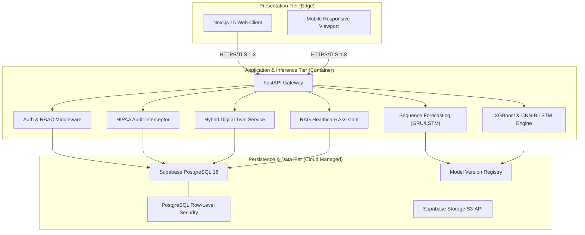
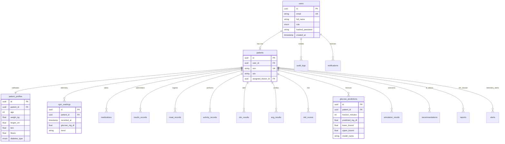

# DigiTwin Health — Deep Architectural Specification

This document provides the formal architectural, mathematical, and machine learning specification for the **DigiTwin Health** platform.

---

## 1. System Design & Topology

DigiTwin Health follows a decoupled, resilient, **three-tier cloud-native SaaS architecture**:



---

## 2. Mathematical Formulation of the Hybrid Digital Twin

The DigiTwin engine models patient metabolic state by coupling a **deterministic biophysical differential system** with an **adaptive deep recurrent neural network**.

### 2.1 The Biophysical Minimal Model
The biophysical core extends the **Bergman Minimal Model of Glucose and Insulin Kinetics**:

$$\frac{dG(t)}{dt} = -(p_1 + X(t)) \cdot G(t) + p_1 \cdot G_b + R_a(t) - E(t) - U_{\text{renal}}(t)$$

$$\frac{dX(t)}{dt} = -p_2 \cdot X(t) + p_3 \cdot (I(t) - I_b)$$

Where:
- $G(t)$: Plasma glucose concentration at time $t$ ($\text{mg/dL}$).
- $G_b$: Basal plasma glucose level ($\sim 90-100\text{ mg/dL}$).
- $X(t)$: Insulin action in the remote compartment ($\text{min}^{-1}$).
- $I(t)$: Plasma insulin concentration ($\mu\text{U/mL}$).
- $I_b$: Basal plasma insulin concentration.
- $p_1$: Insulin-independent glucose disposal rate ($\text{min}^{-1}$).
- $p_2$: Rate constant for spontaneous decrease of insulin action ($\text{min}^{-1}$).
- $p_3$: Parameter governing the sensitivity to insulin ($p_3/p_2 = S_I$, the Insulin Sensitivity Index).
- $R_a(t)$: Rate of appearance of glucose from gut absorption:
  $$R_a(t) = \frac{\text{COB}(t) \cdot f \cdot k_{\text{abs}}}{\text{Vol}_G}$$
  Where $k_{\text{abs}} \approx 0.05-0.08\text{ min}^{-1}$, $f$ is carbohydrate bioavailability ($0.85-0.90$).
- $E(t)$: Exercise-induced glucose uptake in skeletal muscle:
  $$E(t) = \eta \cdot \text{Intensity} \cdot G(t)$$
- $U_{\text{renal}}(t)$: Renal glucose excretion when glucose exceeds the renal threshold ($G_{\text{threshold}} \approx 180\text{ mg/dL}$):
  $$U_{\text{renal}}(t) = \max(0, k_{\text{renal}} \cdot (G(t) - 180))$$

### 2.2 Deep Recurrent Sequence Correction (GRU Residual Modeling)
While the minimal model captures canonical physiological reactions, real-world continuous glucose telemetry contains non-linear circadian drifts, cortisol dawn phenomena, and patient-specific digestion delays. 

A 2-layer **Gated Recurrent Unit (GRU)** takes an input feature tensor:
$$X_t = [G_{t-k \dots t}, \text{IOB}_{t-k \dots t}, \text{COB}_{t-k \dots t}, \text{Activity}_{t-k \dots t}] \in \mathbb{R}^{24 \times 4}$$

The GRU computes hidden state transitions:
$$z_t = \sigma(W_z X_t + U_z h_{t-1} + b_z)$$
$$r_t = \sigma(W_r X_t + U_r h_{t-1} + b_r)$$
$$\tilde{h}_t = \tanh(W_h X_t + U_h (r_t \odot h_{t-1}) + b_h)$$
$$h_t = (1 - z_t) \odot h_{t-1} + z_t \odot \tilde{h}_t$$

### 2.3 Hybrid Model Fusion Equation
The final predicted glucose vector $\hat{G}_{\text{twin}}(t + \Delta t)$ across horizons $\Delta t \in \{30, 60, 90, 120, 240, 360\}\text{ minutes}$ is:

$$\hat{G}_{\text{twin}}(t + \Delta t) = \alpha \cdot G_{\text{phys}}(t + \Delta t) + (1 - \alpha) \cdot \hat{G}_{\text{GRU}}(t + \Delta t) + \Delta_{\text{phenotype}}$$

Where:
- $\alpha \in [0.55, 0.70]$ balances the biophysical constraint and the data-driven residual.
- $\Delta_{\text{phenotype}}$ is an adjustment offset calibrated from the patient's HbA1c, age, and diabetes type ($+6\text{ mg/dL}$ for Type 1, $+2\text{ mg/dL}$ for Type 2).

---

## 3. Machine Learning Models & Pipelines

### 3.1 Glucose Prediction: GRU vs. LSTM Benchmarking

```
Input Sequence [24 steps, 5-min intervals = 2 hours]
(Glucose, Insulin, Carbs, Activity)
       │
       ├─────────────────────────────────────┐
       ▼                                     ▼
┌──────────────┐                      ┌──────────────┐
│  GRU Model   │                      │  LSTM Model  │
│  (36 units)  │                      │  (40 units)  │
└──────────────┘                      └──────────────┘
       │                                     │
       ▼                                     ▼
Linear Projection (6 horizons)        Linear Projection (6 horizons)
       │                                     │
       ▼                                     ▼
Predicted Horizons                     Predicted Horizons
[30m, 60m, 90m, 120m, 4h, 6h]          [30m, 60m, 90m, 120m, 4h, 6h]
```

**Loss Function**: Multi-Horizon Mean Squared Error:
$$\mathcal{L}_{\text{MSE}} = \frac{1}{M \cdot H} \sum_{i=1}^{M} \sum_{h \in \mathcal{H}} (y_{i,h} - \hat{y}_{i,h})^2$$

**Evaluation Metrics**:
1. **Root Mean Square Error (RMSE)**: $\sqrt{\frac{1}{N} \sum (y - \hat{y})^2}$
2. **Mean Absolute Error (MAE)**: $\frac{1}{N} \sum |y - \hat{y}|$
3. **Mean Absolute Percentage Error (MAPE)**: $\frac{100\%}{N} \sum \left|\frac{y - \hat{y}}{y}\right|$
4. **Coefficient of Determination ($R^2$)**: $1 - \frac{\sum (y - \hat{y})^2}{\sum (y - \bar{y})^2}$

---

### 3.2 CBC Hematology Pipeline (XGBoost)
The Complete Blood Count pipeline operates on 10 input variables normalized against adult laboratory reference intervals:

```
[Hb, Hct, RBC, WBC, Plt, Neu, Lym, Mono, Eos, Bas]
                 │
                 ▼
    Multi-Output XGBoost Regressor
                 │
    ┌────────────┼────────────┬─────────────┐
    ▼            ▼            ▼             ▼
 Anemia      Infection    Bleeding    Inflammation
  Risk         Risk         Risk         Score
```

Objective function minimizes regularized squared error:
$$\mathcal{L}_{\text{XGB}} = \sum_{i} l(y_i, \hat{y}_i) + \sum_k \left( \gamma T_k + \frac{1}{2} \lambda \|w_k\|^2 \right)$$

---

### 3.3 ECG Cardiac Intelligence: 1D CNN + BiLSTM
Cardiac intervals and digitized waveform signals are processed through a hybrid spatial-temporal network:

```
Digitized Lead II Strip [Batch, Channels=1, Length=L]
                    │
                    ▼
       1D Conv1D Layer (16 filters, kernel=3) + ReLU + BatchNorm
                    │
                    ▼
       1D Conv1D Layer (32 filters, kernel=3) + ReLU + BatchNorm
                    │
                    ▼
       Bidirectional LSTM (32 hidden units per direction)
                    │
                    ▼
            Pooled Vector [64 dim]
                    │
         ┌──────────┴──────────┐
         ▼                     ▼
Softmax Classification    Sigmoid Risk Head
[7 Arrhythmia Classes]   [Cardiac Risk, Arrhythmia Risk]
```

Classes Detected:
1. Normal Sinus Rhythm
2. Bradycardia ($< 60$ bpm)
3. Tachycardia ($> 100$ bpm)
4. Atrial Fibrillation
5. QT Prolongation ($> 480$ ms)
6. ST Elevation ($\ge 1.0$ mm)
7. ST Depression ($\le -0.8$ mm)

---

### 3.4 Multi-Disease Risk Prediction & SHAP Formulations
An ensemble of **XGBoost**, **Random Forest**, and **LightGBM** predicts five clinical endpoints:
1. Hypoglycemia Risk ($P(\text{Glucose} < 70)$)
2. Hyperglycemia Risk ($P(\text{Glucose} > 180)$)
3. 30-Day Hospitalization Risk
4. 10-Year Cardiovascular Event Risk
5. Micro/Macrovascular Diabetic Complication Risk

**SHAP (SHapley Additive exPlanations)** computes each feature's contribution $\phi_i$:
$$\phi_i(f, x) = \sum_{S \subseteq F \setminus \{i\}} \frac{|S|!(|F| - |S| - 1)!}{|F|!} [f_x(S \cup \{i\}) - f_x(S)]$$

Features with $\phi_i > 0$ elevate clinical risk; features with $\phi_i < 0$ (e.g. physical activity, optimal time-in-range) act as protective factors.

---

## 4. Database Entity-Relationship Diagram (ERD)



---

## 5. Security, RBAC & HIPAA Compliance

### 5.1 Role-Based Access Control (RBAC) Matrix

| Endpoint Group | Patient | Doctor | Admin |
|---|:---:|:---:|:---:|
| `POST /auth/*` (Login/Register) | ✅ | ✅ | ✅ |
| `GET /dashboard` (Own Telemetry) | ✅ | ✅ | ✅ |
| `GET /patients` (Patient List) | ❌ | ✅ | ✅ |
| `POST /glucose/predict` | ✅ | ✅ | ✅ |
| `POST /cbc/analyze` | ✅ | ✅ | ✅ |
| `POST /ecg/analyze` | ✅ | ✅ | ✅ |
| `POST /twin/simulate` | ✅ | ✅ | ✅ |
| `POST /assistant` (RAG Query) | ✅ | ✅ | ✅ |
| `GET /admin/overview` | ❌ | ❌ | ✅ |
| `GET /admin/audit` (Audit Logs) | ❌ | ❌ | ✅ |
| `GET /admin/models` (Model Registry) | ❌ | ❌ | ✅ |

### 5.2 Row-Level Security (RLS) Implementation
PostgreSQL RLS policies evaluate `auth.uid()` claims:
- Patients can only execute `SELECT` on rows where `patient.user_id = auth_user_id()`.
- Attending doctors can query patients where `assigned_doctor_id = auth_user_id()`.
- Admins possess bypass privilege via the service role key.
- Every clinical query triggers an immutable entry in the `audit_logs` table recording user ID, action, resource name, IP address, and timestamp.
